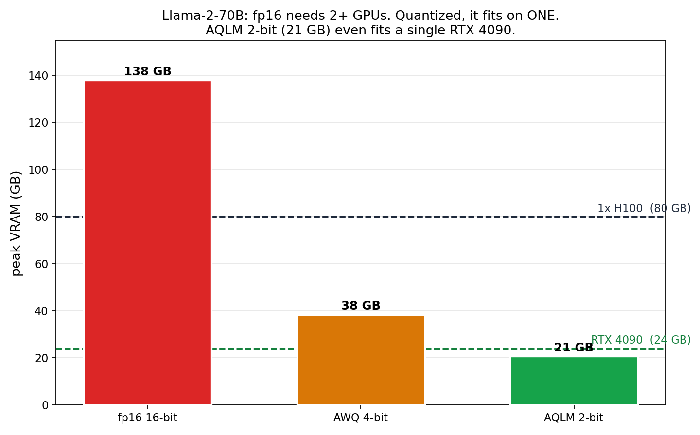

# quant-bench

A fair, reproducible **speed vs accuracy vs memory** benchmark of LLM
weight-quantization methods (fp16, AWQ, AQLM, and a wired-up but not-yet-working
GPTQ / QTIP), measured on a single GPU under one harness.

This is a baseline-establishing measurement ("what does low-bit quantization
actually cost in decode speed, and what does it buy in memory?"), not a new
quantization method. All numbers below were measured on an **NVIDIA H100 PCIe**,
HuggingFace forward path, greedy, batch 1, seed 0, **full wikitext-2 perplexity**.

## Results

### Llama-2-7B (small model, big GPU)


| method | decode | VRAM | wikitext-2 PPL |
|---|---:|---:|---:|
| fp16 | 43.7 tok/s | 15.3 GB | 5.47 |
| AWQ 4-bit | 26.8 tok/s | 5.7 GB | 5.60 |
| AQLM 2-bit | 25.0 tok/s | 4.2 GB | 6.34 |

At 7B on an H100, every quantized method is **slower** than fp16 at single-stream
decode. Quantization here buys memory (15 GB to 4-6 GB), not latency: on a GPU with
this much bandwidth, fp16 decode is already fast and the dequant overhead dominates
at batch 1.

### Llama-2-70B (model too big for fp16 on one GPU)



| method | decode | VRAM | wikitext-2 PPL |
|---|---:|---:|---:|
| fp16 | does not fit | ~138 GB (2+ GPUs) | n/a |
| AWQ 4-bit | 9.1 tok/s | 38 GB | 3.41 |
| AQLM 2-bit | 9.2 tok/s | 21 GB | 4.06 |

The story flips: fp16 70B needs ~138 GB (2+ GPUs). Quantized, it fits on **one**
80 GB H100, and AQLM 2-bit (21 GB) fits a single **RTX 4090**. Here quantization is
not a speed tax, it is what makes the model runnable at all.

Bonus: AQLM 2-bit 70B (PPL 4.06 @ 21 GB) is far more accurate than fp16 7B
(PPL 5.47 @ 15 GB). For a similar memory budget, a 2-bit 70B beats an fp16 7B.

**Sanity check:** fp16 7B = 5.47 PPL matches the published Llama-2-7B value;
AWQ 70B = 3.41 matches published. The numbers line up with the literature.

## Methodology (so it is not debunkable)

- Every method is loaded through the **same HuggingFace forward path** and timed by
  the **same loop**: this isolates the quantization kernel's cost, not a serving
  engine. A vLLM / TensorRT-LLM serving comparison is a separate study.
- Greedy decoding, fixed seq lengths, **fixed seed 0**, warmup + median of 3.
- Each method uses its own intended kernel (AQLM, AWQ); none is crippled. Library
  versions are captured in the JSON, so the kernel is identifiable.

## Honest limits

- **GPTQ and QTIP are not in the results.** `gptqmodel` would not build on the test
  pod (3 attempts), and QTIP (Cornell-RelaxML/qtip) is a custom research repo that
  needs manual wiring; the loader hook is present but the checkpoint id / install
  must be completed. AWQ represents the 4-bit point and AQLM the 2-bit point. The
  skips are recorded in `results.json`.
- HF forward harness (not a tuned serving engine); 7B on an H100 is the regime where
  dequant overhead is most visible. Different GPUs / batch sizes shift the picture.

## Run

```bash
bash setup.sh          # torch 2.4.0+cu121 + transformers 4.44.2 + aqlm/awq, pinned
huggingface-cli login  # only if you swap in gated checkpoints
python bench_quant.py --only fp16,aqlm-2bit,awq-4bit --out results.json
python plot_pareto.py results.json --out pareto.png
python plot_mem70.py   # 70B memory bar (uses results_70b.json)
```

`setup.sh` encodes the dependency recipe that actually works (the trap: RunPod
images ship an old torch / CUDA 11.8 while modern quant libs need torch 2.4 / CUDA
12; pin torch so nothing silently upgrades it).

## Files

- `bench_quant.py` - the harness (load, time decode/prefill, full PPL, JSON out)
- `plot_pareto.py` - speed vs PPL scatter, bubble area = VRAM
- `plot_mem70.py` - 70B memory bar (fits-on-one-GPU)
- `setup.sh` - working dependency recipe
- `results.json`, `results_70b.json` - measured numbers
- `pareto.png`, `mem70.png` - the figures

## License

CC BY 4.0 (see `LICENSE`). Cite via `CITATION.cff`.
